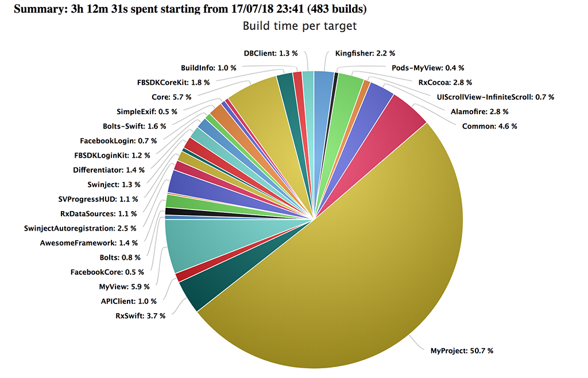

# xcode-buildtime-profiler
A bunch of scripts that creates a report with a summary of time spent on building your project.

With the help of these scripts, you can easily profile how much time you spend building your project during the day.

### Usage

First, you need to install dependency gem by running `sudo gem install terminal-notifier`. This command will install gem [terminal-notifier](https://github.com/julienXX/terminal-notifier) which required to notify you each time you build your project and provide some summary.

`buildtime_profiler_patch.rb` is the first entry point. Here you need to specify your project name and path.
Just redefine `$project_name` and `$project_dir` variables in 136th and 137th lines.

After this step run `ruby buildtime_profiler_path.rb`. This will add all necessary build phases to all the targets of your project and Pod project as well. 

Each target will have two new **Run Script** build phases: `[Build time profiler] Log time before build` and `[Build time profiler] Log time after build`. 

The main target will also have two additional phases: `[Build time profiler] Build times counter` and `[Build time profiler] Summary`. The last one is running *buildtime_profiler_summarize.rb* to prepare summary and *terminal-notifier* to show alert.

In order to create ***report.html*** just tap notification. You can also make it manually by running `ruby buildtime_reporter.rb /path/to/summary.json`.

To clean up your project from generated phases run `ruby buildtime_profiler_path.rb clean`

### Example

[An example of notification](example/screenshot.png)

[An example of generated report](http://htmlpreview.github.io/?https://github.com/rnkyr/xcode-buildtime-profiler/blob/master/example/report.html)

[An example of generated summary file](example/summary.json)
